## Background

:::: {.columns}

::: {.column width="40%"}

**The Team**: Transitioned from standalone meso-scale models (FiPy, OOF) to a
unified focus on AM Digital Twins for microstructure prediction.

**The Effort**: Building self-correcting AM models by fusing real-time data and
surrogate models using Data Assimilation.

**Expertise**: High-fidelity physical modeling, meso-scale physical modeling,
scientific & HPC computing and building deterministic workflows.

:::

::: {.column width="60%"}
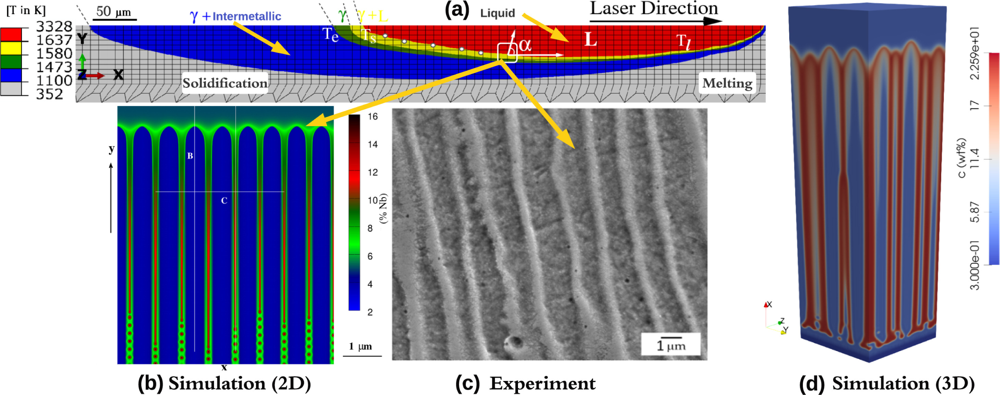

<b>Source:</b> [D. Banerjee] Ghosh <em>et al.</em>, <em>Addit. Manuf.</em> (2023).

:::

<!-- ::: {.column width="60%"} -->

<!--  -->

<!-- 
 -->
<!-- <b>Multi-Scale Coupling:</b> (a) Melt pool temperature boundaries via 3D -->
<!-- FEA. (b, d) 2D and 3D Phase Field simulations of cellular microstructures -->
<!-- generated using extracted $G$ and $R$ values. (c) Experimental validation of -->
<!-- the predicted cellular morphology. <i>[D. Banerjee] Ghosh et al., -->
<!-- Addit. Manuf. (2023)</i> 
 -->

<!-- ::: -->

::::

::: {.notes}
* Computer Scientist leading NIST's Microstructure-Property tool project
* **The physics handoff:** The macro-scale FEA computes the overall thermal field to extract two master variables at the melt pool boundary: G and R.
* **G (Thermal Gradient):** The steepness of the temperature change at the solid-liquid interface.
* **R (Solidification Velocity):** The speed at which that interface is moving.
* **Why they matter:** Their ratio (G/R) dictates the shape of the grains—like the transition from cellular to dendritic—and their product (G×R) gives the cooling rate, dictating the microstructural scale.
* **The Pivot to DA:** This figure represents state-of-the-art predictive modeling. But it is entirely open-loop. If the actual laser degrades mid-print, the physical G and R change. Our forward model won't know, and the predicted microstructure will be completely wrong. We need data assimilation to anchor these models to reality.
:::

---

## Overview

* **AM Digital Twin Ecosystem at NIST**
* **Digital Twins:** Concepts
* **Proposed Digital Twin Architecture:** A framework for continuous state
  inference
* **Data Assimilation:** An overview of merging real-time observations with
  physical forecasts
* **Julia DA Engine:** An engine that orchestrates a modular, multi-solver
  pipeline
* **DA Example:** Demonstrating in-process estimation with
  AdditiveFOAM

---

## AM Digital Twin Ecosystem at NIST

:::: {.columns}

::: {.column width="50%"}

* **AMMT Testbed (Ho Yeung):** Establishing a precision control system for
  ground-truth in-AM-process data.
* **Thermodynamics (Fan Zhang):** Predicting local phase evolution and rapid
  solidification kinetics.
* **Fatigue (Erik Furton):** Correlating metal AM in-situ pore detection with
  macroscopic mechanical performance and fatigue life.
* **In-Process Inference (Our Focus):** Fusing sensor observations with physics
  forecasts to track the evolving thermal and microstructure state.

:::

::: {.column width="50%"}
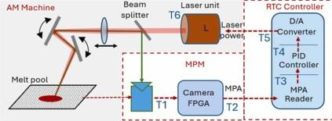

<b>Source:</b> H. Yeung, "Toward Real-time Feedback Control for Powder Bed Fusion Additive Manufacturing," <em>Additive Manufacturing</em> (2025).

:::

::::

---

## Digital Twins

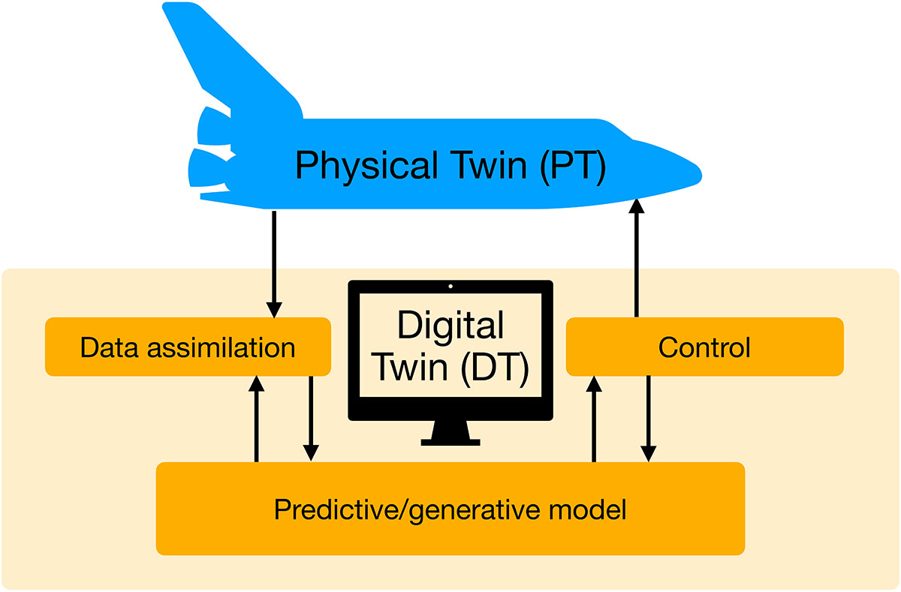{fig-align="center" width="70%"}

<b>Source:</b> S. Reich, "Digital Twins: Synergy Between Data Assimilation and Optimal Control," <em>SIAM News</em> (2025).

<!-- ![[S. Reich], "Digital Twins: Synergy Between Data Assimilation and Optimal Control," SIAM News (2025) -->
<!-- ](images/digital-twin.jpg){fig-align="center" width="70%"} -->

<!-- Data Assimilation Box -->
::: {.absolute .floating-box top="65%" left="4%" style="font-size: 0.5em;"}
**Inference**

$$ p(X, \theta \mid Y) \propto \underbrace{p(Y \mid X, \theta)}_{\text{min} \|Y - H(X)\|} \, p(X, \theta) $$

:::

<!-- Optiman Control Box -->
::: {.absolute .floating-box top="65%" left="70%" style="font-size: 0.5em;"}
**Optimization**

$$ u^* = \arg\min_{u} \mathbb{E}_{X \sim p(X \mid Y)} \big[ C(X, u) \big] $$

:::

---

## Proposed Digital Twin Architecture

:::: {.columns}

::: {.column width="50%"}

* **System Goal:** A framework that connects state estimation to physical
  machine execution.
* **Our Contribution:** Developing the in-process inference engine using Data
  Assimilation and FNO surrogates.
* **The Digital Shadow:** A fully actuated digital twin is a long-term goal. We
  are currently focusing on the digital shadow that validates our state
  estimates against experimental data.

:::

::: {.column width="50%"}

{height="550px"}

:::

::::

---

## Data Assimilation: What is it?

:::: {.columns}

::: {.column width="50%"}

* Physical models inevitably drift from reality over time, requiring a way to
  reconcile them with noisy, sparse sensor data.
* Real-time observations are dynamically fused with forward physical forecasts.
* This allows for continuous, on-the-fly correction of both the physical
  thermal state ($X$) and latent machine parameters ($\theta$) during the
  build.

:::

::: {.column width="50%"}
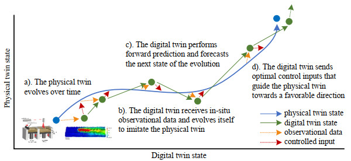

<b>Source:</b> Liu <em>et al.</em> (2024). "Deep neural operator enabled digital twin modeling for additive manufacturing." <em>Advances in Computational Science and Engineering</em>

:::

::::

::: {.notes}
* Explain that we aren't just calibrating after the fact; we are tracking the state as it evolves.
* Considerations: time scales, latency, noise characterization, model dimensionality.
:::

---

## Data Assimilation: Inference Loop {.smaller}

:::: {.columns}

::: {.column width="50%"}

1. **Forward Forecast:** Advance the physical state using the forward model
   ($\mathcal{M}$).  $$X_{f} = \mathcal{M}(X_{a}, \theta)$$

2. **Observation Prediction:** Map the forecast state to the sensor space using
   the observation operator ($\mathcal{H}$).  $$\hat{Y} = \mathcal{H}(X_{f})$$

3. **Innovation (Residual):** Calculate the difference between the true sensor
   observations ($Y$) and the prediction.  $$v = Y - \hat{Y}$$

4. **Analysis (Update):** Correct the state using the Kalman Gain ($K$) to
   optimally balance model and sensor uncertainty.  $$X_{a} = X_{f} + K v$$

:::

::: {.column width="50%"}
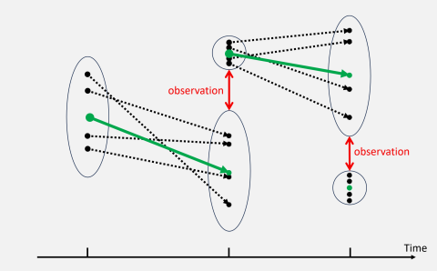

<b>Source:</b> Cheng <em>et al.</em> (2025) "TorchDA: A Python package for performing data assimilation with deep learning forward and transformation functions."

:::

<!-- ::: {.column width="50%"} -->
<!--  -->
<!-- ::: -->

::::
 
---

## Julia DA Engine

:::: {.columns}

::: {.column width="40%"}

* **Performance:** Native execution speeds for complex EnKF state-parameter
  calculations.
* **Modularity:** A completely solver-agnostic assimilation pipeline.
* **Scalability:** Automated HPC orchestration for distributed ensemble
  deployments.
* **Reproducibility:** Deterministic multi-language environments
  (Julia/Python/C++) managed via Nix.

:::

::: {.column width="60%"}

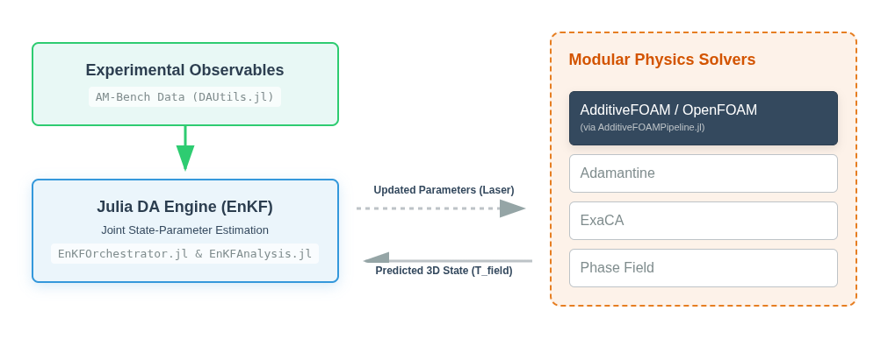{width="100%"}

 The custom
Julia engine (EnKFOrchestrator.jl) completely decouples the observation data
and assimilation logic from the forward forecast. This modularity allows us to
swap between heavy PDE solvers (AdditiveFOAM, Adamantine, ExaCA) and
lightweight surrogates without rewriting the core inference loop.  

:::

::::

::: {.notes}
* The architecture was heavily inspired by the TorchDA framework but
  purpose-built for the NIST AM ecosystem.
* Emphasize the Python interop: we get Julia's C-level speed for the math, but
  seamlessly call PyVista for OpenFOAM mesh manipulation.
* Explain the HPC scaling: the orchestrator programmatically manages the
  massive memory overhead of running 50+ concurrent OpenFOAM instances.
* Nix integration: Emphasize that deploying this many moving parts is only
  possible because Nix guarantees the environment is exactly the same
  everywhere.
:::
 
---

## DA Example: AdditiveFOAM {.smaller}

:::: {.columns}

::: {.column width="50%"}

**Setup (AdditiveFOAM)**

* Single-track laser melt on IN718 adapted from **AMB2018-02-B** single-track
  tutorial.
* True laser power dynamically shifts (300W $\rightarrow$ 400W).

**Assimilated Data**

* Sparse thermal probes (varying sensor densities of 4, 8, 16, 32, or 40 points along the track).
* Melt pool dimensions.

**Objective: Joint Estimation**

* Initialize the twin with a deliberate 100W error.
* Recover latent laser power and correct the 3D thermal field on the fly.

:::

::: {.column width="50%"}

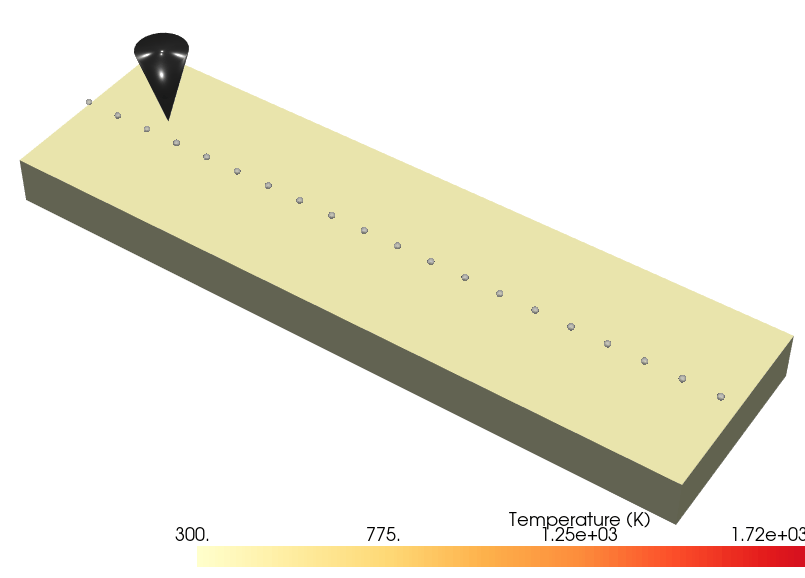{width="80%"}

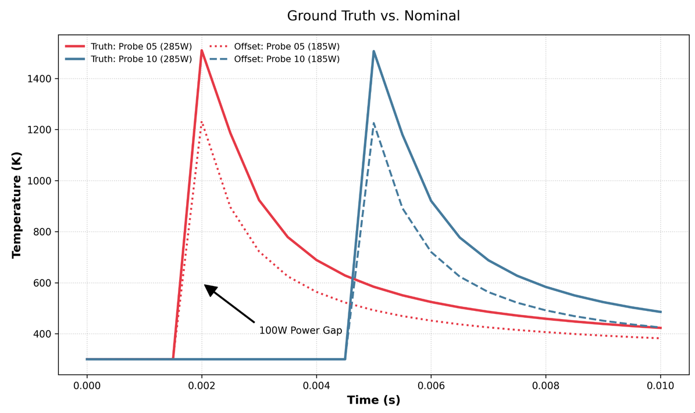{width="80%"}

 <b>Top:</b> Simulated thermal field and probe
placement. <b>Bottom:</b> Thermal history at two probe locations, comparing the
true state and uncorrected 100W-offset. 

:::

::::

---

## DA Example: State Only Update

:::: {.columns}

::: {.column width="50%"}

* **Setup:** 20-member ensemble assimilates data from 32 thermal probes every 0.0005 s.
* **Constraint:** The temperature state is updated, but the laser power is locked at an
  incorrect 300 W (True = 400 W).
* **Outcome:** The temperature field snaps to reality during the assimilation
  step, but the underlying heat source remains incorrect.

:::

::: {.column width="50%"}

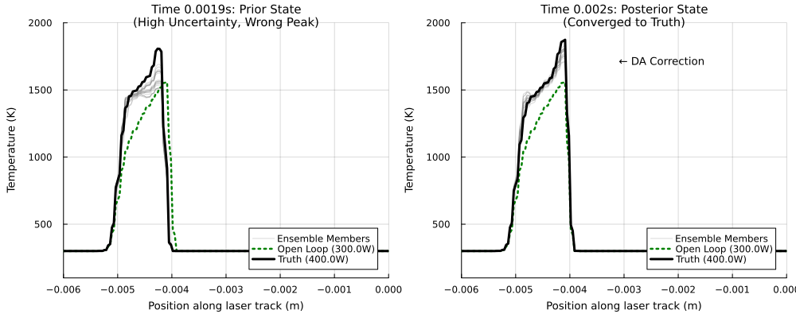
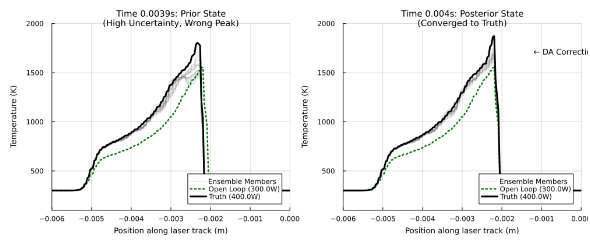

 <b>Top:</b> DA correction at 0.002 s. <b>Bottom:</b> DA
correction at 0.004 s. Left panels show the drifting prior; right panels show
the ensemble snapping to the true 400W state during assimilation.  

:::

::::

---

## DA Example: Joint Update {.smaller}

:::: {.columns}

::: {.column width="50%"}

**Setup**

* 32 thermal probes, 20-member ensemble, 0.0005 s assimilation steps.

**Constraint**

* **Joint Update:** The filter is permitted to simultaneously correct both the
  temperature field and the laser power.

**Outcome**

* **Parameter:** Recovers the 400 W truth. Instabilities due to spatial
  aliasing between the moving laser, discrete probe locations and DA events.
* **State:** The underlying heat source is better aligned so the temperature
  profile maintains better agreement and develops less inter-step drift.

:::

::: {.column width="50%"}

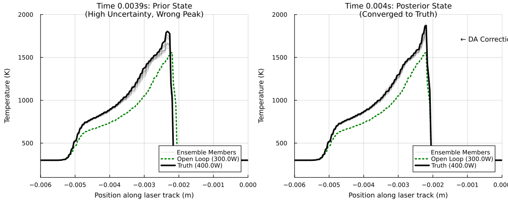
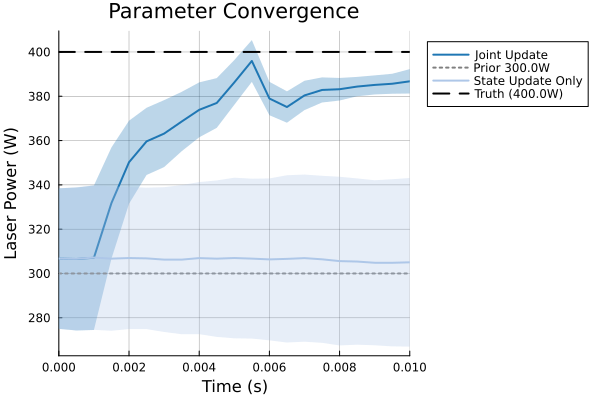{width="75%" fig-align="center"}

<b>Top:</b> Joint update of the temperature field.
<b>Bottom:</b> Parameter convergence.  

:::

::::

---

## DA Example: Sparse Probes {.smaller}

:::: {.columns}

::: {.column width="50%"}

**Setup**

* Joint state-parameter estimation using varying thermal probe densities (4 to
  40 probes).

**Constraint**

* The filter must overcome spatial sparsity to recover the true 400 W laser
  power from an incorrect 300 W prior.

**Outcome**

* **Sub-optimal (≤32 probes):** Fails to recover the true power or suffers from
  volatile spatiotemporal aliasing.
* **Optimal (40 probes):** Eliminates aliasing and smoothly converges to the
  400 W truth.

:::

::: {.column width="50%"}

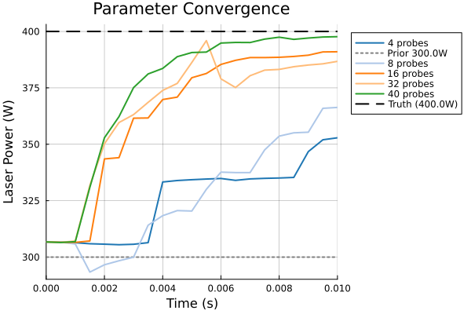

<b>Parameter Convergence:</b> The effect of sensor density on recovering the
true laser power. Densities of 40 probes eliminate spatiotemporal aliasing and
converge smoothly on the 400 W target.

:::

::::

---

## DA Example: Geometry Constraints {.smaller}

:::: {.columns}

::: {.column width="50%"}

**Setup**

* Assimilating macroscopic melt pool geometry (length or width) into the
  filter.

**Constraint**

* Testing if physical geometry constraints can compensate for a complete lack
  of thermal probe data (0 probes).

**Outcome**

* **Parameter Recovery:** The filter successfully discovers the true 400 W
  laser power using only geometry constraints, without a single temperature
  probe in the build.
* **Shape Capture:** Directly constraining the geometry yields significantly
  more accurate and stable melt pool dimensions than relying on dense
  (40-probe) thermal arrays.

:::

::: {.column width="50%"}

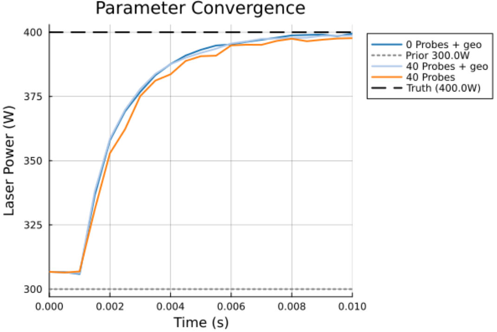{width="70%" fig-align="center"}

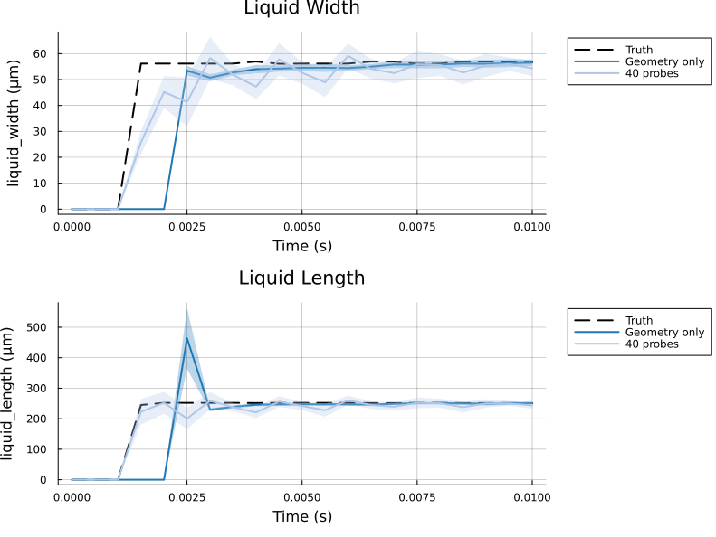{width="70%" fig-align="center"}

<b>Top:</b> Parameter convergence recovering the 400 W truth using 0 probes
plus geometry. <b>Bottom:</b> Melt pool dimensions tracking over time;
the geometry-only update outperforms the 40-probe thermal array in capturing
the true shape.  

:::

::::

---

## DA Example: Minimal Geometry Constraints

:::: {.columns}

::: {.column width="50%"}

**Setup**

* Assimilating only melt pool length *or* width independently.

**Constraint**

* Determine the absolute minimum data required to recover the true 400 W laser
  power.

**Outcome**

* A single geometric attribute (e.g., width only) is completely sufficient to
  recover the true power.

:::

::: {.column width="50%"}

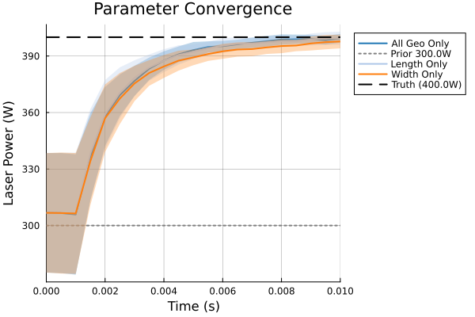{width="100%" fig-align="center"}

<b>Parameter Convergence</b>

:::

::::

---

## Summary

* **Foundation Established:** Successfully validated the core Data Assimilation
  engine using synthetic thermal and geometric models.
* **Experimental Transition:** Moving to active assimilation of noisy,
  real-world data using NIST AM-Bench and AMMT data.
* **Future Work (Microstructural DA):** Integrating solvers like ExaCA into the
  assimilation loop to actively predict and correct local grain structure and
  texture.

---

## Postdoc Opportunity: NIST NRC RAP

:::: {.columns}

::: {.column width="60%"}

**Digital Twin Framework for Metal AM**

* Physics-based models + surrogates, DA, UQ, L-PBF, DED
* **Location:** NIST Gaithersburg, MD 

:::

::: {.column width="40%"}

**Let's talk.** 
daniel.wheeler@nist.gov 
dilip.banerjee@nist.gov

 

{width="60%" fig-align="center"}

RAP Opportunity: <b>50.64.21.C0951</b>

:::

::::

